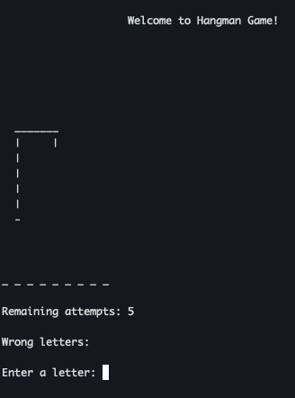
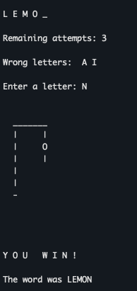
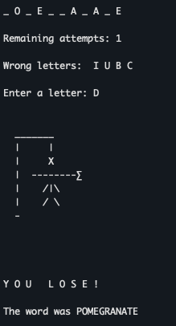

<h1 align="center"> Hangman Game </h1>

It's a simple example of the Hangman game using Python language. The game have only fruit names for while.

<h2 align="left"> Badges and Technologies</h2>

* 
*  :construction: WIP :construction:

 
<h2 align="left"> Rules </h2>
<li>You have 5 attemps to guess the fruit name;</li>
<li>For each wrong letter, a part of man is shown on the hang;</li>
<li>If you put a wrong letter 5 times, it's game over!</li>

 

 
<h2 align="center"> Functionalities </h2>
When you run the hangman.py, this is the game starting:

If you get the word right, this is the screen:

If you don't, this is the game over screen:

 

